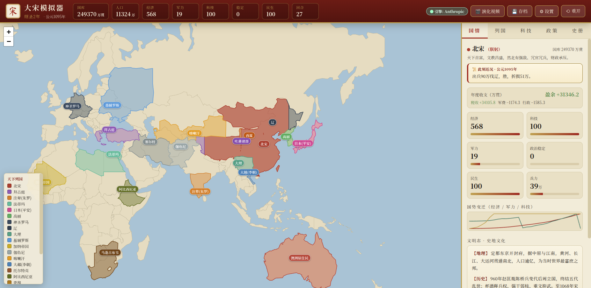
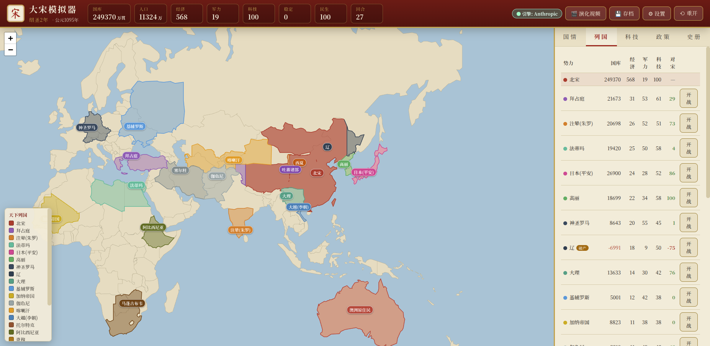
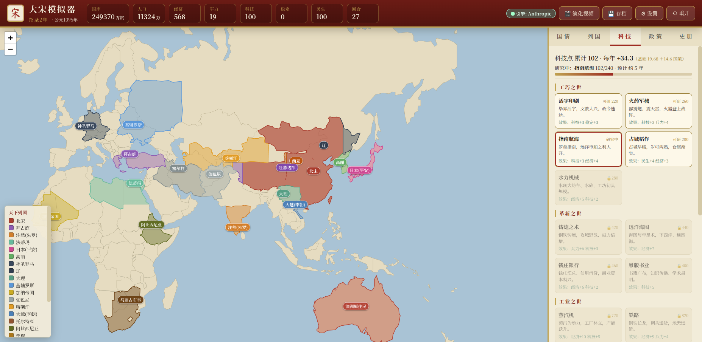
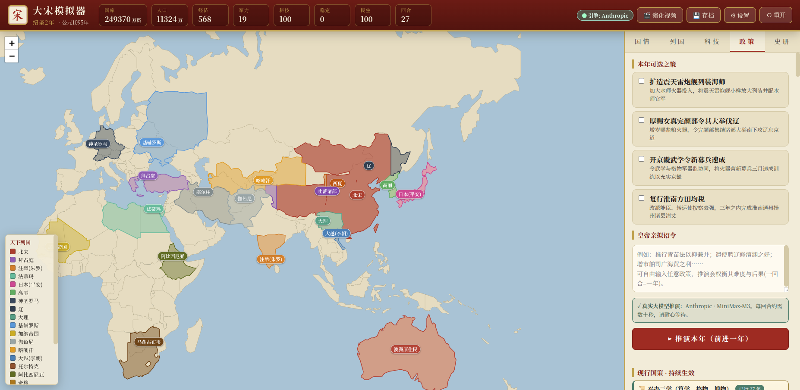
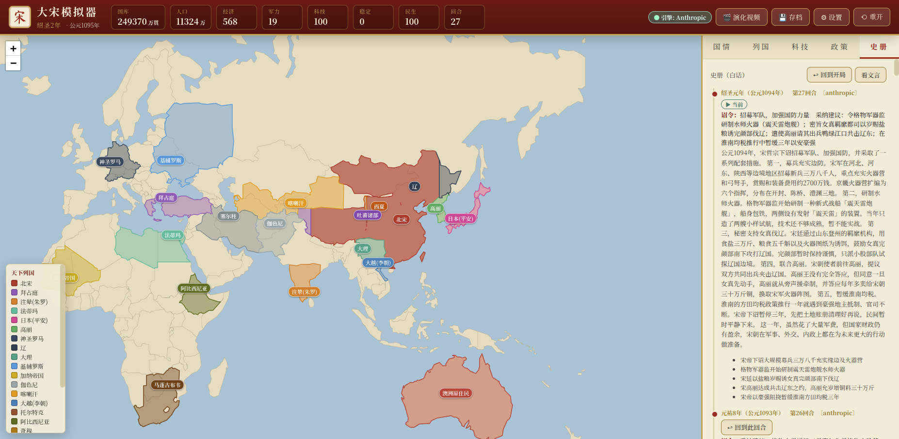
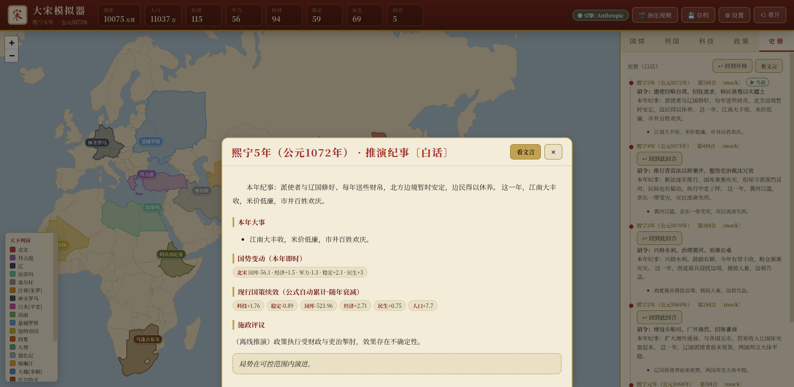
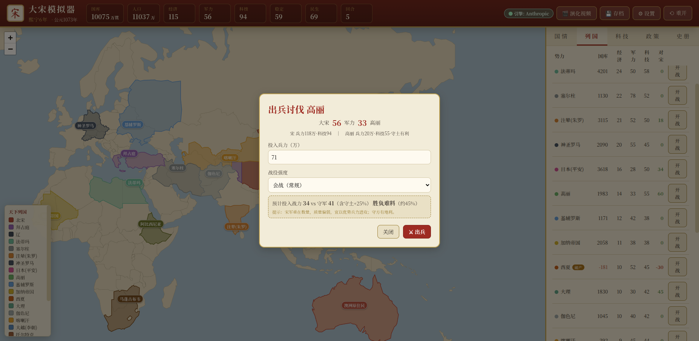

# 大宋模拟器 · Da Song Simulator

> 你是大宋皇帝。从北宋熙宁元年（1068 年）开始，逐年颁布国策，让接入的**大语言模型**依据真实历史规律推演全球文明的兴衰演化——经济、科技、军事、政治，无所不包。
>
> An LLM-driven grand-strategy sandbox: play the Emperor of Song, issue yearly policies in free text, and let a large language model simulate how the whole world evolves.



---

## ✨ 这是什么

一个**以真实历史为底本、由大模型驱动**的回合制历史推演游戏：

- **你颁布政策，AI 推演后果。** 不是预设的科技树点点点，而是**自由输入任意诏令**（"推行青苗法"、"遣使聘辽修澶渊之好"、"经略台湾移民垦殖"……），由 LLM 权衡其**实施难度、既得利益阻力、民意、地理限制**，给出可能**出人意料**的结果（执行走样、天灾、党争、外敌反应）。
- **影响范围是全球。** 真实世界地图上有 **23 个势力**（北宋、辽、西夏、塞尔柱、拜占庭、注辇……乃至美洲的托尔特克/密西西比、非洲的加纳、澳洲原住民），各有经济、军事、科技、外交，并对大宋的行为做出反应。
- **一回合 = 一年。** 时间以年推进，配合按真实时间轴校准的科技、经济、人口节奏。
- **接入任意大模型。** 统一客户端支持 **OpenAI 兼容**与 **Anthropic** 两种格式（OpenAI / DeepSeek / GLM / 本地模型皆可），另带**离线规则引擎**，无需密钥即可试玩。

---

## 📸 截图一览

| 列国对比（国库 / 军力 / 外交 / 开战议和） | 科技树（宋代工巧 → 大模型 AI） |
|---|---|
|  |  |

| 政策与现行国策 | 史册编年（可回溯到任意一年） |
|---|---|
|  |  |

| 推演纪事（文言 / 白话双版本） | 纯公式化战役结算 |
|---|---|
|  |  |

---

## 🎮 核心玩法（一个回合）

1. **查看天下大势**：地图与「列国」面板里，各势力的国库、经济、军力、科技、对宋关系一览无余；点击任一文明可看其**史地文化详解**与**此刻近况**。
2. **谋定研究方向**：在「科技」树里选定要攻关的科技（科研缓慢，需靠国力与文教政策加速）。
3. **颁布国策**：勾选系统给的建议，或**自由输入任意诏令**。
4. **推演本年**：LLM 据当前世界状态 + 你的政策推演一整年，产出**叙事（文言+白话）、重大事件、各势力数值变动、新政的长期影响系数**。
5. **运筹外交与征伐**：对任一势力可**开战**（纯公式战役结算）或**议和**（割地按面积改地图、赔款改两国国库）。
6. 周而复始，见证大宋与世界数十年乃至数百年的演化——并可随时**导出一段演化视频**。

---

## 🧩 特性总览

### 推演与叙事
- **自由文本政策** + LLM 严肃推演（考虑难度、阻力、意外）。
- **文言 / 白话双叙事**，一键切换（默认白话，易读）。
- **现行国策 = 影响系数 + 时间衰减**：颁布一次，引擎此后逐年**按公式自动累计**其影响，无需每年把旧政文本重喂给模型（省 token、可持续）。支持 `{init, steady}` 时间剖面表达「先投入后回报」（研发）与「先小后大、持续收益」（口岸），以及 `half_life`（成熟半衰期·年）刻画「大后期」政策。

### 全球地图
- 真实世界底图 + **23 势力领土**，内部边界用**分形中点位移**生成「犬牙交错」的自然边界（非直线方框）。
- **疆域随推演动态扩张**：LLM 自主判断——占据**无主之地**（如台湾）或**吞并败国**时，引擎与陆地求交后**重绘地图**并改色。

### 确定性模拟层（不经过 LLM 的"物理引擎"，逐年对所有势力结算）
- **国库收支**：`税收(经济) − 军费(兵力×武器) − 行政(人口)`，大宋年年有结余；让国库消耗有据可依。
- **军力量化**：`军力 = 兵力 × 武器系数(随科技) × 民族战力`（辽骑兵战力高、宋兵多质弱，皆还原史实）。
- **破产连锁**：国库见底 → 军队欠饷哗变、民生凋敝、政局动荡（敌我一视同仁）。
- **科技树**（参考文明6精简）：活字印刷/火药/指南 → 蒸汽/铁路/电报 → 电力/内燃机 → 计算机/互联网/**大模型 AI**。科研速率按 **1068→今约 958 年 / 全树约 16790 点 ≈ 18 点/年** 校准；兴学、设格物院、开科取士等政策可加成科研速度（加多少由 LLM 裁决）。
- **纯公式化战役**：设投入兵力与战役强度，按双方战力 + 守土优势 + 战场偶然算胜负与伤亡；军力归零即被占领。开战弹窗有「投入战力 vs 守军」实时估算。

### 存档与回放
- **命名存档 / 读档 / 删档**，重开不清除存档。
- **时间回溯**：「史册」里每个历史年份都可「↩ 回到此回合」从该处重新演化。
- **演化视频导出**：把每回合的世界快照（地图按国力着色 + 日期 + 国力榜 + 当年纪事）渲染成 mp4。

---

## 🚀 快速开始

```bash
git clone git@github.com:zhangfeiyang/DaSongSimulation.git
cd DaSongSimulation
./run.sh                 # 首次自动建虚拟环境、装依赖，然后启动
# 浏览器打开 http://127.0.0.1:8000
```

默认使用**离线推演引擎**（`mock`，无需任何 API Key 即可完整试玩）。

> 依赖：Python 3.10+；演化视频功能需要系统已装 `ffmpeg`（可选）。

---

## 🔌 接入大模型

点界面右上「⚙ 设置」，或复制 `config.local.json.example` 为 `config.local.json` 填写：

| provider | 说明 | model 示例 | base_url |
|---|---|---|---|
| `mock` | 离线启发式推演，无需密钥 | — | — |
| `anthropic` | Anthropic Messages API | `claude-opus-4-7` | 留空=官方，或填三方网关 |
| `openai` | OpenAI 兼容（OpenAI / DeepSeek / GLM / 本地 vLLM / Ollama …） | `gpt-4o` / `deepseek-chat` | 如 `https://api.deepseek.com/v1` |

- 两路均使用**流式传输**：推理型模型（如 glm / DeepSeek-R1）思考较久也不会触发超时。
- LLM 返回的 JSON 若有未转义引号等常见错误，会用 `json-repair` 自动修复兜底。
- Anthropic 路径对稳定的系统提示启用 **prompt caching**，多回合降低输入成本。

---

## 🏗️ 架构

```
backend/                FastAPI + SQLite（无重型 ORM）
  config.py             配置与 LLM provider 切换
  db.py / models.py     SQLite 表结构 / API 模型
  llm/
    client.py           统一 LLM 客户端（anthropic / openai 流式 + mock）
    prompts.py          系统提示 + 世界状态→用户消息
    mock.py             离线启发式推演
  game/
    seed_data.py        1068 年 23 势力初始数据 + 开局近况
    lore.py             各文明史地文化详解
    territory.py        真实国界裁剪 + 犬牙交错(分形)边界
    sim.py              确定性经济/军事/破产结算（逐年·全势力）
    tech.py             精简科技树 + 科研推进
    war.py              战役结算 / 议和割地赔款 / 领土并入
    state.py            世界状态读写、存档读档、时间回溯
    engine.py           回合引擎：载状态→调LLM→应用政策系数→确定性结算→落库→推进一年
    video.py            演化视频（matplotlib + ffmpeg）
  main.py               API 端点 + 托管前端
frontend/               原生 JS + Leaflet（向量底图，离线可用）
data/                   world.geojson 世界底图；game.db / factions.geojson 运行时生成
```

**回合数据流**：玩家政策 → 载入当前世界状态 + 现行国策 + 近期纪事 → 组装提示词 → LLM 返回严格 JSON（叙事 / 事件 / 各势力即时变动 / 新国策系数 / 领土变更）→ 引擎应用政策系数（含时间衰减）→ 确定性经济/军事/科技结算 → 写库、推进一年 → 前端刷新地图、仪表盘、史册。

---

## ⚠️ 已知简化 / 可继续扩展
- 时间回溯目前不还原地图领土（领土变更未做版本化快照）。
- 离线 `mock` 引擎仅基于关键词启发，真实开放式推演请接入 LLM。
- 战役为单次结算，未做多线战争 / 同盟连锁 / 多回合战役。
- 可继续扩展：网页内回放播放器、外交同盟体系、贸易网络、瘟疫与气候、多皇帝存档等。

---

## 致谢

- 世界底图来自公开的 Natural Earth 派生 GeoJSON。
- 由 [Claude Code](https://claude.com/claude-code) 协助开发。

欢迎 Issue / PR。
